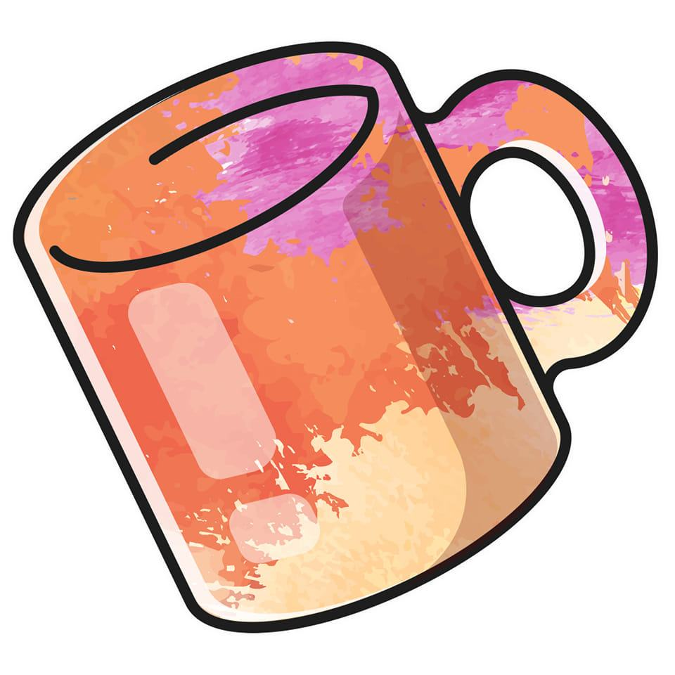

  <h1>Mugged - Progressive Web App</h1>

  
  
<em>Customizable Gift Shop - Personalized Mugs & More</em>

## About the Project 📖  

**Mugged** is a customizable gift shop specializing in personalized mugs and other gift items. This **Progressive Web App (PWA)** was developed as the **final year project** for the **Work Integrated Learning (WIL)** module, a key component of the Diploma in Information Technology in Software Development.  

The **WIL module** is designed to integrate theoretical knowledge with real-world application, emphasizing teamwork, project management, and professional development. The module required us to complete a full software development lifecycle (SDLC), including:  
1. **Project Planning**  
2. **Requirements Analysis**  
3. **System Design**  
4. **Development**  
5. **Testing**  
6. **Deployment**  

This project allowed us to gain hands-on experience with industry-standard tools and methodologies, preparing us for professional roles in software development.  

## Project Overview 💻  

**Mugged PWA** is a dynamic application developed using **HTML**, **CSS**, **JavaScript**, and **ASP.NET MVC**. It features a robust backend powered by an **Azure SQL Database** and integrates **Azure DevOps** for efficient project management, testing, and deployment.  

The application enables users to personalize mugs with text and images, browse products in a visually appealing gallery, and complete purchases through a secure and responsive interface.  

Key phases of the project:  
1. **Project Plan**: Defined goals, milestones, and deliverables, including risk management strategies and technical feasibility.  
2. **Requirement Analysis**: Gathered and documented functional and non-functional requirements, use case diagrams, and logical system models.  
3. **System Design**: Created database schemas, architectural diagrams, and UI mockups using Figma and Draw.io.  
4. **Development**: Implemented both frontend and backend functionality using Visual Studio 2022, adhering to coding standards and agile practices.  
5. **Testing**: Conducted unit testing, integration testing, and user acceptance testing, leveraging Azure Test Plans and NUnit.  
6. **Deployment**: Set up CI/CD pipelines for seamless deployment and maintenance using Azure Pipelines.

## Features ✨  

- **Customizable Products**: Users can personalize mugs with text and images.  
- **Responsive Design**: Accessible on mobile, tablet, and desktop devices.  
- **Offline Functionality**: Built as a PWA for uninterrupted access.  
- **Secure Checkout**: Integrates with secure payment gateways.  
- **Product Gallery**: Displays available gift items with customization options.  
- **User-Friendly Interface**: Easy-to-navigate design for seamless interaction.  

## Technologies Used 🔧  

### **Frontend**  
- HTML5, CSS3, JavaScript (ES6+)  
- Bootstrap for responsive design  
- Service Workers for PWA functionality  

### **Backend**  
- ASP.NET MVC Framework  
- C# for server-side logic  
- Azure SQL Database for data management  

### **DevOps**  
- Azure DevOps: CI/CD Pipelines, Azure Boards  
- Git for version control (hosted on GitHub)  

### **Design & Prototyping**  
- Figma: UI/UX Mockups  
- Draw.io: System diagrams and architectural designs  

### **Testing**  
- NUnit: Unit testing for backend logic  
- Azure Test Plans: Automated and manual testing  

## Project Lifecycle 🔄  

### 1. Project Plan  
We began with a comprehensive project plan that defined:  
- Goals and objectives  
- Milestones and deliverables  
- Risk analysis and mitigation strategies  
- Feasibility studies (technical, operational, and economic)  
- Team roles and responsibilities  

The **Gantt charts** and **PERT diagrams** created using MS Project guided our timelines and critical paths.

### 2. Requirements Analysis  
The next phase involved gathering and analyzing the functional and non-functional requirements:  
- **Use Case Diagrams**: Defined system interactions and actors.  
- **Logical System Model**: Outlined inputs, outputs, processes, and relationships.  
- **Functional Specifications**: Documented all system capabilities and constraints.  

### 3. System Design  
The system design phase included:  
- **Database Design**: Normalized schema in 3NF, ensuring referential integrity.  
- **Architectural Design**: High-level and low-level diagrams showcasing the system’s architecture (three-tier design).  
- **UI/UX Mockups**: Created in Figma for a consistent and user-centric interface.  
- **ERD Diagrams**: Defined entity relationships and data structures.  

### 4. Development  
Development was divided into **frontend** and **backend** components:  
- Frontend: Built using **HTML**, **CSS**, and **JavaScript** with responsive design principles.  
- Backend: Developed in **ASP.NET MVC** with C# to handle server-side logic and APIs.  

Version control was maintained via **GitHub**, with pull requests and branch protection rules ensuring code quality.

### 5. Testing  
A rigorous testing process ensured the application met all requirements:  
- **Unit Testing**: NUnit for backend methods.  
- **Integration Testing**: Verified API and database interactions.  
- **Manual Testing**: Checked UI responsiveness and user flows.  
- **Automated Testing**: Conducted using Azure Test Plans.  

### 6. Deployment  
The project was deployed using **Azure DevOps**:  
- **CI/CD Pipelines**: Automated builds and deployments for consistent updates.  
- **Hosting**: Application hosted on Azure App Service for scalability and reliability.  
- **Monitoring**: Regular monitoring to ensure performance and uptime.  

## Skills Gained 🚀  

This project allowed us to develop the following skills:  

- **Agile Project Management**  
- **Full-Stack Web Development**  
- **DevOps and CI/CD Pipeline Creation**  
- **Collaborative Development** using Git and Azure Boards  
- **Effective Communication and Teamwork**  

## Roles and Contributors 👥  

**Team Name**: Code Craft Collective  

| Name                         | Role                                   | GitHub Profile                                      |  
|------------------------------|---------------------------------------|---------------------------------------------------|  
| Moses J. Gallant             | Project Manager/Team Leader           | [GitHub Profile](https://github.com/MainG10)      |  
| Justin Plaatjies             | Business Analyst/Software Designer/Secretary | [GitHub Profile](https://github.com/Justinsimplyis) |  
| Sibusiso Ngqangwani          | Database Administrator                | [GitHub Profile](https://github.com/ST10118588)   |  
| Babalo Skosana               | DevOps Engineer                       | [GitHub Profile](https://github.com/ShadyX-Gottwald) |  
| Nour El Deen M. Hassan       | Frontend Developer                    | [GitHub Profile](https://github.com/NoureldeenHassan) |  
| Franklyn H. Pedro            | Backend Developer                     | [GitHub Profile](https://github.com/FranklynPedro) |  
| Mulisa Mabasa                | Testing Lead/Quality Assurance Engineer | [GitHub Profile](https://github.com/Mul)          |  

## Acknowledgment 🙏  

We would like to express our deepest gratitude to everyone who contributed to the successful completion of this project:  

- **Varsity College Nelson Mandela Bay** for providing us with a structured and practical **Work Integrated Learning (WIL)** module, which allowed us to apply theoretical knowledge to real-world challenges.  
- **Courteney Young** and **Reece Wanvig**, our lecturers, for their invaluable guidance, constructive feedback, and continuous support throughout this project.  
- **Emmanual Jaftha**, our mentor, for his expert advice, encouragement, and technical insights during key phases of the project.  
- **Mugged** for giving us the opportunity to develop a Progressive Web App tailored to their business needs and for their collaborative feedback.  
- **Azure** and **GitHub Platforms** for their comprehensive tools and services that facilitated project management, development, and deployment.  
- **Team Code Craft Collective**, for their dedication, teamwork, and technical expertise in ensuring the successful delivery of this project.  

This project was an invaluable learning experience that not only strengthened our technical skills but also prepared us for future professional challenges.  

## License 📜  

This project is licensed under the **MIT License**. See the [LICENSE](LICENSE) file for details.  

🔗 **Live Demo**: [View the project on Azure](https://muggedshop20241125211528.azurewebsites.net/) 

